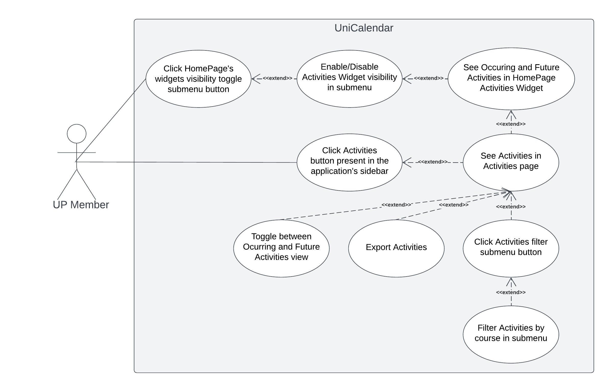
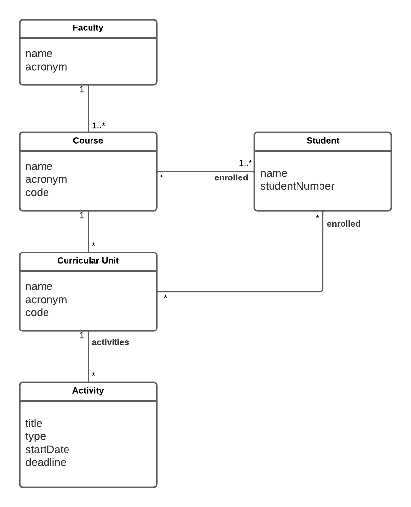

# Requirements

## Use case model

|||
|-|-|
| *Name* | Click HomePage's widgets visibility toggle submenu button |
| *Actor* | UP Member |
| *Description* | The UP member clicks a button that'll lead him to the visibility toogle submenu, where he can select which widgets are presented to him in the HomePage. |
| *Preconditions* | None |
| *Postconditions* | Open the visibilty toggle submenu. |
| *Normal flow* | 1. The UP member starts the UNI app.  2. The HomePage is presented to the UP member, containing a button that'll lead him to the widgets visibilty toggle submenu.  3. The UP member clicks the button.  4. The submenu is presented to the UP member. |
| *Alternative flows and exceptions* | None |

|||
|-|-|
| *Name* | Enable/Disable Activities Widget visibility in submenu |
| *Actor* | UP Member |
| *Description* | The UP member chooses to enable or disable the UniCalendar HomePage widget in the visibilty toggle submenu. |
| *Preconditions* | The visibility toggle submenu is selected. |
| *Postconditions* | The widget must be visible or invisible according to the option selected. |
| *Normal flow* | 1. The UP member starts the UNI app.  2. The HomePage is presented to the UP member, containing a button that'll lead him to the widgets visibilty toggle submenu.  3. The UP member clicks the button.  4. The submenu is presented to the UP member.  5. The UP member selects or deselects the UniCalendar widget visibility option. |
| *Alternative flows and exceptions* | None |

|||
|-|-|
| *Name* | See Occuring and Future Activities in HomePage Activities Widget |
| *Actor* |  UP Member | 
| *Description* | The UP member sees occuring and future activities through the UniCalendar widget present in the homepage. |
| *Preconditions* | The UniCalendar widget visibilty is enabled. |
| *Postconditions* | None |
| *Normal flow* | 1. The UP member starts the UNI app.  2. The HomePage is presented to the UP member, containing the UniCalendar widget. |
| *Alternative flows and exceptions* | 1. [Widget is not visible] If, in step 2 the UniCalendar visibility isn't enabled the HomePage is presented to the UP member without it. |

|||
|-|-|
| *Name* | Click Activities button present in the application's sidebar |
| *Actor* | UP Member |
| *Description* | The UP member clicks the Activities button in the application's sidebar that'll lead him to the activities page. |
| *Preconditions* | Open the application's sidebar. |
| *Postconditions* | Open the activities page. |
| *Normal flow* | 1. The UP member starts the UNI app. 2. The UP member clicks opens the sidebar. 3. The UP member clicks on the Activities button. 4. The Activities page is displayed. |
| *Alternative flows and exceptions* | None |

|||
|-|-|
| *Name* | See Activities in Activities page |
| *Actor* |  UP Member | 
| *Description* | The UP member sees Activities in the Activities page. |
| *Preconditions* | Open the Activities page. |
| *Postconditions* | None |
| *Normal flow* | 1. The UP member starts the UNI app.  2. The HomePage is presented to the UP member, containing the UniCalendar widget (if visible).  3. The UP member clicks the UniCalendar widget.  4. The Activities page is presented to the UP member. |
| *Alternative flows and exceptions* | 1. [Accessing the Activites page through the sidebar] If, in step 2 the UP member opens the application's sidebar and clicks on the Activities page button it'll lead him to the Activities page as well. |

|||
|-|-|
| *Name* | Toggle between Ocurring and Future Activities view |
| *Actor* | UP Member |
| *Description* | The UP member can switch between the Ongoing and Future Activities in the Activities page. |
| *Preconditions* | Open the Activities page. |
| *Postconditions* | Switched from Ongoing to Future activities and vice-versa. |
| *Normal flow* | 1. The UP member starts the UNI app.  2. The HomePage is presented to the UP member, containing the UniCalendar widget (if visible).  3. The UP member clicks the UniCalendar widget.  4. The Activities page is presented to the UP member.  5. The UP member clicks on the Ongoing activities button.  6. The ongoing activities are displayed. |
| *Alternative flows and exceptions* | 1. [Accessing the Activites page through the sidebar] If, in step 2 the UP member opens the application's sidebar and clicks on the Activities page button it'll lead him to the Activities page as well.  2. [Future activities button] if, in step 3 the UP member clicks on the Future activities button the Future activities are displayed instead. |

|||
|-|-|
| *Name* | Export Activities |
| *Actor* | UP Member |
| *Description* | The UP member exports the activities as an ICS file so that it can be easily imported to any external calendar that supports it. |
| *Preconditions* | Open the Activities page. |
| *Postconditions* | The UP member gets the calendar as an ICS file. |
| *Normal flow* | 1. The UP member starts the UNI app.  2. The HomePage is presented to the UP member, containing the UniCalendar widget (if visible).  3. The UP member clicks the UniCalendar widget.  4. The Activities page is presented to the UP member, containing a button to export the activities.  5. The UP member clicks the button.  6. The UP member gets the calendar as an ICS file. |
| *Alternative flows and exceptions* | 1. [Accessing the Activites page through the sidebar] If, in step 2 the UP member opens the application's sidebar and clicks on the Activities page button it'll lead him to the Activities page as well. |

|||
|-|-|
| *Name* | Click Activities filter submenu button |
| *Actor* | UP Member |
| *Description* | The UP member clicks the Activities filter submenu button present in the Activities page. |
| *Preconditions* | Open the Activities page. |
| *Postconditions* | Open the Activities filter submenu. |
| *Normal flow* | 1. The UP member starts the UNI app.  2. The HomePage is presented to the UP member, containing the UniCalendar widget (if visible).  3. The UP member clicks the UniCalendar widget.  4. The Activities page is presented to the UP member, containing a button that'll lead him to the Activities filter submenu.  5. The UP member clicks the button.  6. The submenu is presented to the UP member. |
| *Alternative flows and exceptions* | 1. [Accessing the Activites page through the sidebar] If, in step 2 the UP member opens the application's sidebar and clicks on the Activities page button it'll lead him to the Activities page as well. |

|||
|-|-|
| *Name* | Filter Activities by course in submenu |
| *Actor* | UP Member |
| *Description* | The UP member is able to filter the Activities that are displayed by course. |
| *Preconditions* | Open the Activities page. |
| *Postconditions* | Filter the displayed Activities. |
| *Normal flow* | 1. The UP member starts the UNI app.  2. The HomePage is presented to the UP member, containing the UniCalendar widget (if visible).  3. The UP member clicks the UniCalendar widget.  4. The Activities page is presented to the UP member, containing a button that'll lead him to the Activities filter submenu.  5. The UP member clicks the button.  6. The submenu is presented to the UP member.  7. The user customizes the filters.  8. The activities pages is displayed again only with the activities that match the applied filters. |
| *Alternative flows and exceptions* | 1. [Accessing the Activites page through the sidebar] If, in step 2 the UP member opens the application's sidebar and clicks on the Activities page button it'll lead him to the Activities page as well. |

### User stories
 - [As an UP member, I want to see a Activities calendar widget on the homescreen, so that I can quickly check if I'm keeping up with my deadlines.](https://github.com/LEIC-ES-2021-22/3LEIC03T3/issues/1)
 - [As an UP member, I want to see an Activities calendar page, so that I can check all my deadlines, filter them by date or course and export the activities calendar if I please.](https://github.com/LEIC-ES-2021-22/3LEIC03T3/issues/2)
 - [As an UP member, I want to be able to filter the calendar for ongoing and future activities by their course, so that I can easily keep track of the deadlines of a single or multiple courses.](https://github.com/LEIC-ES-2021-22/3LEIC03T3/issues/3)
 - [As an UP member, I want to click on the homescreen activities widget, so that I can go to the Activities page to check the complete list of activities, filter them by date or course and export the activities calendar if I please.](https://github.com/LEIC-ES-2021-22/3LEIC03T3/issues/4)
 - [As an UP member, I want to be able to export an activity to an external calendar application, so that I can easily synchronize with my everyday use calendar and manage my time more efficiently.](https://github.com/LEIC-ES-2021-22/3LEIC03T3/issues/5)
 - [As an UP member, I want to be able to access the activities page through a button on the application sidebar, so that I can go to the Activities page to check the complete list of activities, filter them by date or course and export the activities calendar if I please.](https://github.com/LEIC-ES-2021-22/3LEIC03T3/issues/6)

### Domain model

 

  

